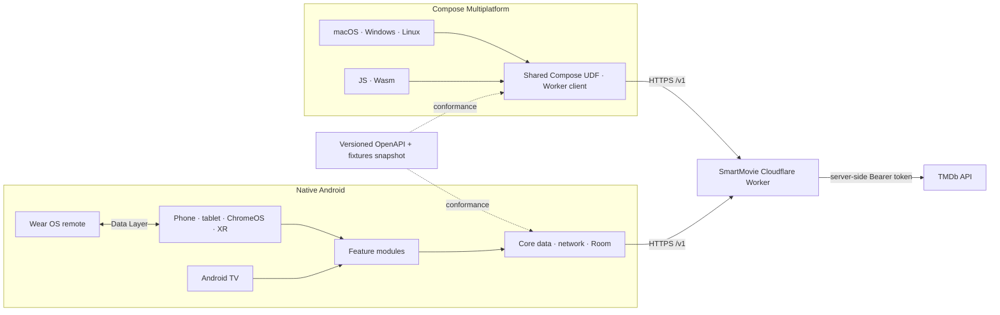

# SmartMovie 2.0 — Android, Wear OS, desktop and web

[](https://github.com/LamPPKK/Android.Smart.Movie/actions/workflows/android-ci.yml)
[](https://github.com/LamPPKK/Android.Smart.Movie/actions/workflows/multiplatform-ci.yml)

SmartMovie is a cinematic movie and TV catalog built natively for Android. Discover titles, filter the catalog, search, open rich details and trailers, and keep independent Favorite and Watchlist collections that remain readable offline.

The native app adapts from phones to tablets, foldables, ChromeOS, Android TV, and Android XR Home Space. A Wear OS companion turns the watch into a remote for the title open on the paired phone. An isolated Compose Multiplatform app brings the same product flow to macOS, Windows, Linux, and responsive Web/Wasm.

> [!NOTE]
> SmartMovie is a catalog and trailer app. It does not stream movies or TV episodes, require a SmartMovie account, display advertising, or offer in-app purchases.

> [!IMPORTANT]
> SmartMovie 2.0 is under active development. Automated source gates are in place; production Worker domains, protected signing identities, final store artwork, and Play metadata still require release-owner configuration.

## Two repositories, one SmartMovie 2.0

| Repository | Owns | Mobile release role |
| --- | --- | --- |
| **[Android.Smart.Movie](https://github.com/LamPPKK/Android.Smart.Movie)** (this repository) | Native Android and Wear OS apps, Compose Multiplatform desktop/web app, checksummed contract snapshot | Google Play source of truth |
| **[SmartMovie](https://github.com/LamPPKK/SmartMovie)** | Native SwiftUI Apple apps, `SmartMovieKit`, Cloudflare Worker, canonical OpenAPI 3.1 contract and fixtures | App Store source of truth and backend owner |

The Apple and Android mobile apps keep native UI, lifecycle, and local persistence while sharing the same `/v1` catalog behavior, six locales, semantic release train, error rules, and decoder fixtures. There is intentionally no cross-platform account or Favorite/Watchlist synchronization in 2.0.

## What you can do

- **Discover movies and TV series** from curated Home shelves for trending, popular, top-rated, now playing/on air, and upcoming titles.
- **Explore with useful filters** for media type, genre, year, rating, and sort order, backed by deduplicated Paging data.
- **Search quickly** with debounce, cancellation, retry handling, and Movie, TV Series, or All scopes.
- **Open rich title details** with ratings, release data, genres, overview, runtime or seasons, cast, similar titles, and language-aware YouTube trailers.
- **Keep a private local library** with independent Favorite and Watchlist actions stored in Room on Android and platform-local storage in the desktop/web app.
- **Use an interface built for each screen**: bottom navigation on phones, rail/list-detail layouts on larger windows, a dedicated 10-foot TV composition, and compact Wear OS actions.
- **Navigate without touch** using keyboard shortcuts on ChromeOS/desktop and focus-preserving D-pad navigation on Android TV.
- **Use the app in six languages**: English, Vietnamese, Japanese, Korean, Simplified Chinese, and Traditional Chinese.

## Screenshots

All images below are checked-in deterministic captures. The native Android images are also visual-regression baselines used by CI.

### Native Android phone and tablet

<table>
  <tr>
    <td width="34%" align="center"><strong>Phone</strong><br><sub>Compact Home with bottom navigation</sub></td>
    <td width="66%" align="center"><strong>Tablet · foldable · ChromeOS · XR Home Space</strong><br><sub>Expanded navigation rail and denser content shelves</sub></td>
  </tr>
  <tr>
    <td align="center"></td>
    <td align="center"></td>
  </tr>
</table>

### Android TV and Wear OS

<table>
  <tr>
    <td width="72%" align="center"><strong>Android TV</strong><br><sub>10-foot layout with high-visibility D-pad focus</sub></td>
    <td width="28%" align="center"><strong>Wear OS remote</strong><br><sub>Open details, launch trailer, Favorite, and Watchlist</sub></td>
  </tr>
  <tr>
    <td align="center"></td>
    <td align="center"></td>
  </tr>
</table>

### Compose Multiplatform — desktop and web

The Kotlin Multiplatform app shares one Compose UI/data layer across macOS, Windows, Linux, JavaScript, and Wasm. It is separate from the native Android modules and does not replace the native SwiftUI Apple mobile app.

<table>
  <tr>
    <td width="66%" align="center"><strong>Expanded desktop/web</strong><br><sub>Navigation rail and responsive content grid</sub></td>
    <td width="34%" align="center"><strong>Compact detail</strong><br><sub>Trailer, library actions, story, and cast</sub></td>
  </tr>
  <tr>
    <td align="center"></td>
    <td align="center"></td>
  </tr>
</table>

See the complete [screen gallery](docs/SCREENSHOTS.md) for Home, Explore, Search, Detail, Library, and responsive layout captures. [Platform support](docs/PLATFORM_SUPPORT.md) defines the exact release boundary for every device class, including why Android Auto is intentionally not declared.

## App and platform matrix

| App / device | Minimum / target | Experience | Release artifact |
| --- | ---: | --- | --- |
| Android phone | Android 8 / API 26+ | Four-destination bottom navigation and compact detail flow | Main Android AAB |
| Tablet and foldable | Android 8 / API 26+ | Adaptive rail, expanded shelves, and list-detail layouts | Main Android AAB |
| ChromeOS | Android 8 / API 26+ | Resizable windows, pointer, and Ctrl/Cmd shortcuts | Main Android AAB |
| Android TV | Android 8 / API 26+ | Dedicated 10-foot UI, D-pad focus, TV search, retained navigation state | Main Android AAB |
| Android XR | Home Space panel | Resizable adaptive 2D experience; no immersive scene in 2.0 | Main Android AAB |
| Wear OS | Paired companion | Non-standalone remote over the Play services Data Layer | Wear companion AAB |
| Desktop | macOS 13+, Windows 10+, Ubuntu 20.04-compatible Linux | Shared Compose app with local library and native installers | DMG/PKG, MSI/EXE, DEB/RPM |
| Web | Modern JS/Wasm browser | Responsive Compose app with browser-local library; beta | Static JS/Wasm distribution |

The main and Wear AABs use the same Play application identity, semantic version, version code, and signing key. Desktop/web releases are independently verified and do not block an Android or Play Store release.

## Architecture



The native UI uses unidirectional data flow with immutable `UiState`, `StateFlow`, and screen-level ViewModels. Constructor-injected repositories keep UI modules independent from Retrofit, Room, and transport details. The KMP project has its own shared UDF state, Worker client, persistence adapters, and adaptive Compose UI under `multiplatform/`.

### Module map

| Module | Responsibility |
| --- | --- |
| `app` | Mobile entry point, dedicated TV activity, Navigation 3, adaptive navigation, and application container |
| `core:model` | Immutable domain models and repository contracts |
| `core:network` | Retrofit, Kotlin Serialization, installation identity, retry/cancellation policy |
| `core:database` | Room library, migrations, and committed schemas |
| `core:data` | Repository implementations, image URL policy, Paging sources |
| `core:remote` | Versioned phone/watch commands and state serialization |
| `core:designsystem` | Cinematic palette, offline fonts, and shared accessible components |
| `feature:*` | Home, Explore, Search, Library, Detail, and About |
| `wear` | Compose for Wear OS companion and Data Layer remote |
| `catalog-contract` | Checksummed snapshot of the canonical Worker contract and fixtures |
| `multiplatform/composeApp` | Desktop/web shared state, client, persistence, UI, and platform entry points |

## Repository layout

```text
Android.Smart.Movie/
├── app/                 # Native Android phone/tablet/TV/XR application
├── wear/                # Wear OS companion application
├── core/                # Model, network, database, data, remote, design system
├── feature/             # Product feature modules
├── catalog-contract/    # Versioned snapshot from the canonical Worker contract
├── multiplatform/       # Desktop JVM plus JS/Wasm Compose application
├── release/             # Shared SmartMovie 2.0 release-train manifest
├── scripts/             # Read-only Doctor and scoped release checks
├── docs/                # Screenshots, testing, privacy, platform support, release docs
└── .github/workflows/   # Native CI, emulator smoke tests, KMP builds, signed releases
```

## Getting started

### Requirements

- JDK 17 for native Android
- JDK 21 for Compose desktop/web
- Android SDK 36 and Build Tools 36.0.0
- Android Studio with an API 35 phone image for instrumentation tests
- An Android TV emulator image for D-pad smoke testing

Run the read-only environment check before Gradle:

```sh
./scripts/doctor.sh
```

Clone and build the native apps:

```sh
git clone https://github.com/LamPPKK/Android.Smart.Movie.git
cd Android.Smart.Movie
./gradlew --dependency-verification=strict :app:assembleDebug :wear:assembleDebug
```

The native debug build calls `https://staging-catalog.smartmovie.app/`; release calls `https://catalog.smartmovie.app/`. Both expose only the matching SmartMovie Worker `/v1` contract. No TMDb or Cloudflare credential belongs in either client.

### Run desktop or web

The multiplatform project is deliberately isolated so its JDK 21 and Compose toolchain cannot destabilize the locked Android/Play build.

```sh
cd multiplatform
./gradlew :composeApp:run
./gradlew :composeApp:wasmJsBrowserDevelopmentRun
```

See [`multiplatform/README.md`](multiplatform/README.md) for JS, Wasm, desktop packaging, and platform-specific local storage.

## Tests and quality gates

Run the native source gates from the repository root:

```sh
./gradlew --dependency-verification=strict \
  :core:model:test \
  :core:remote:test \
  testDebugUnitTest \
  validateDebugScreenshotTest \
  lintDebug \
  :app:assembleDebug \
  :wear:assembleDebug \
  :app:assembleDebugAndroidTest \
  :app:bundleRelease \
  :wear:bundleRelease

./scripts/verify-release.sh mobile
```

The native baseline contains 38 unit, contract, network, remote, feature, and screenshot-validation tests. CI also runs phone instrumentation on API 35 and a dedicated Android TV launch/D-pad smoke test with Linux KVM enabled.

Run KMP verification independently with JDK 21:

```sh
cd multiplatform
./gradlew --dependency-verification=strict \
  :composeApp:desktopTest \
  :composeApp:compileKotlinDesktop \
  :composeApp:jsBrowserDevelopmentExecutableDistribution \
  :composeApp:wasmJsBrowserDistribution

cd ..
./scripts/verify-release.sh kmp
```

Read [Testing](docs/TESTING.md) for the complete suite, emulator setup, golden update policy, and reports.

## Contract compatibility

`catalog-contract/` is a checksummed snapshot of the canonical OpenAPI document and fixtures from the companion Apple/backend repository. Native Android and KMP conformance tests decode the same success and error fixtures, including unknown fields and missing nullable values.

The manifest records the contract version, upstream commit, OpenAPI SHA-256, and fixture SHA-256. A protected cross-repository workflow opens or refreshes the Android snapshot PR whenever the canonical contract changes. Production Worker promotion is blocked until Android `main` matches all four release inputs.

Run `./scripts/verify-release.sh mobile`, `./scripts/verify-release.sh kmp`, or omit the scope to check the full repository. A store candidate also requires a real 40-character upstream commit in the manifest; the local bootstrap marker is development-only.

## Privacy and security

- TMDb authentication exists only in the companion repository's protected Worker secrets.
- The Android library is stored in Room and included in Google Auto Backup; HTTP cache and the installation UUID are excluded.
- Wear OS commands and current-title state travel only through the paired-device Data Layer.
- KMP libraries remain local to each platform: Java Preferences on desktop and `localStorage` on web.
- There is no SmartMovie account, analytics SDK, advertising SDK, in-app purchase flow, or real-time cross-platform synchronization.

## Release status

The shared release manifest pins SmartMovie `2.0.0`. Android `versionName` matches the Apple marketing version; Android `versionCode` and Apple build numbers increase independently.

The protected `production` GitHub environment must provide `ANDROID_KEYSTORE_BASE64`, `ANDROID_KEYSTORE_PASSWORD`, `ANDROID_KEY_ALIAS`, and `ANDROID_KEY_PASSWORD`. The signed release workflow produces both the main and Wear companion AABs for the same Play listing. Desktop signing/notarization identities are separate and do not block Play delivery.

Before Play submission, activate the Worker domains, pass the contract smoke tests, configure signing, run Play Internal Testing on phone/tablet/TV/Wear devices, and complete store artwork, screenshots, privacy, and support metadata.

## Attribution

This product uses the TMDB API but is not endorsed or certified by TMDB. Movie and television metadata and artwork are supplied by [The Movie Database](https://www.themoviedb.org/).
