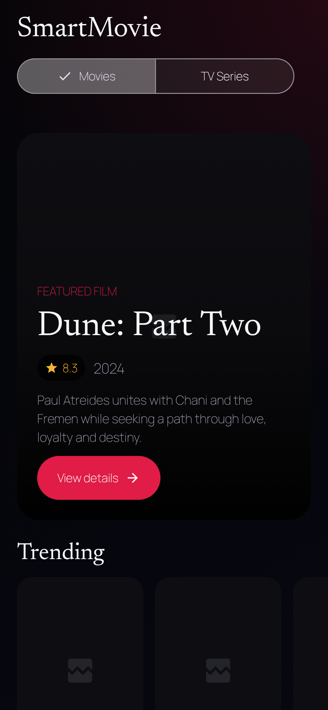
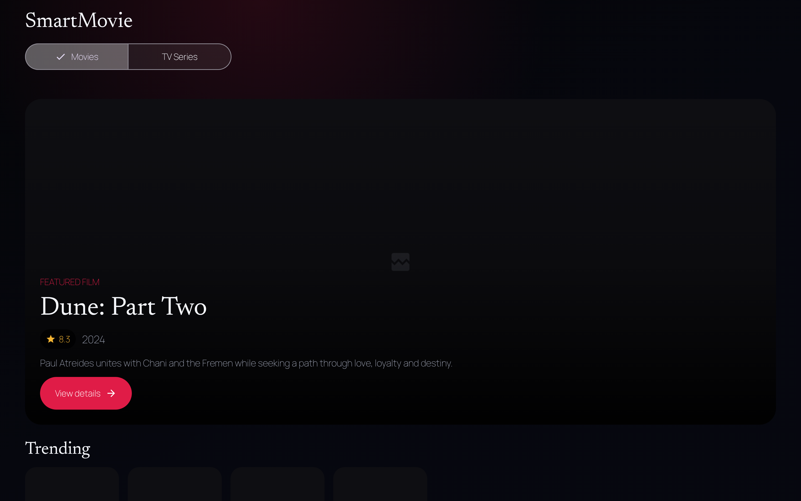
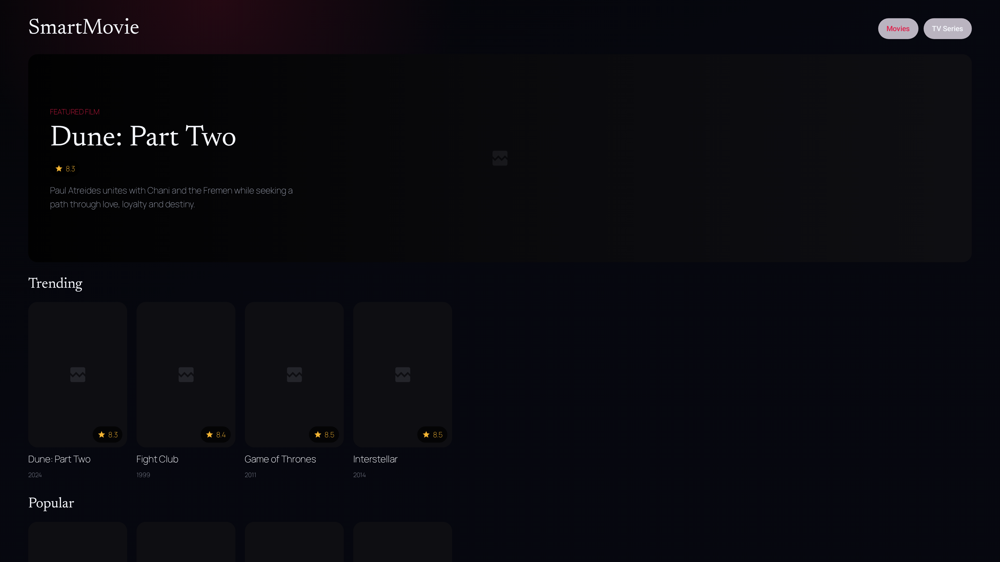
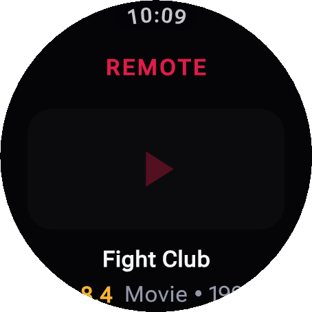
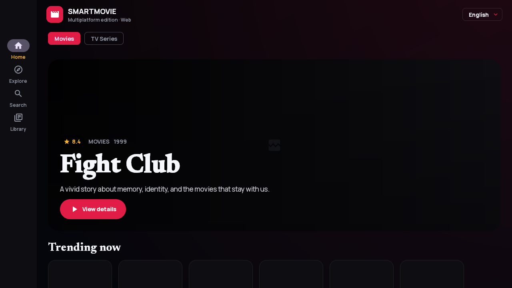
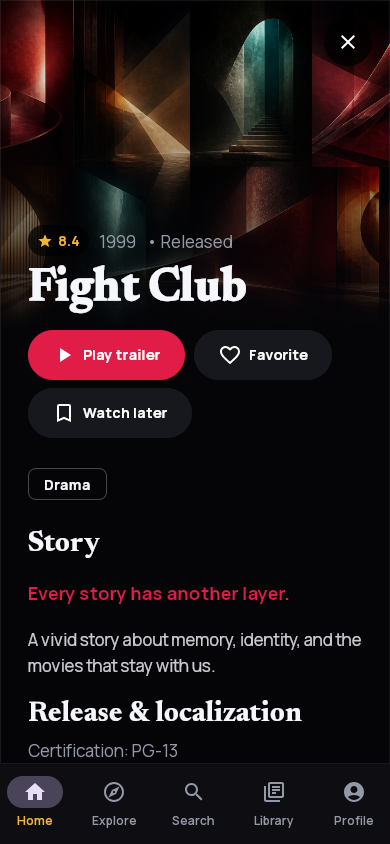
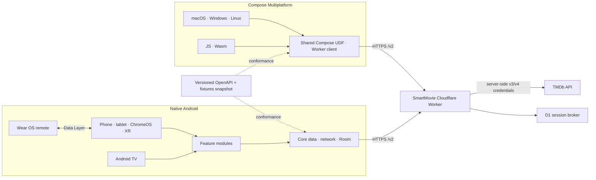

# Smart Movie Android 3.0 — Android, Wear OS, desktop and web

[](https://github.com/LamPPKK/Smart-Movie-Android/actions/workflows/android-ci.yml)
[](https://github.com/LamPPKK/Smart-Movie-Android/actions/workflows/multiplatform-ci.yml)

SmartMovie is a cinematic TMDb catalog built natively for Android. It covers movies, television, people, collections, organizations, keywords, seasons, and episodes; adds region-aware availability and trailers; and can optionally synchronize library, ratings, recommendations, and mixed lists through browser-approved TMDb access.

The native app adapts from phones to tablets, foldables, ChromeOS, Android TV, and Android XR Home Space. A Wear OS companion mirrors the safe title or exact episode open on the paired phone and hands back to the matching detail. An isolated Compose Multiplatform app brings the same product flow to macOS, Windows, Linux, and responsive Web/Wasm.

> [!NOTE]
> SmartMovie is a catalog and trailer app. It does not stream movies or episodes, create a separate SmartMovie identity, collect a TMDb password, display advertising, or offer in-app purchases.

> [!IMPORTANT]
> SmartMovie 3.0 is under active development. Automated source gates are in place; production Worker D1/session configuration, protected signing identities, final store artwork, privacy/support URLs, and Play metadata still require release-owner configuration.

## Two repositories, one SmartMovie 3.0

| Repository | Owns | Mobile release role |
| --- | --- | --- |
| **[Smart Movie Android](https://github.com/LamPPKK/Smart-Movie-Android)** (this repository) | Native Android and Wear OS apps, Compose Multiplatform desktop/web app, checksummed contract snapshot | Google Play source of truth |
| **[Smart Movie iOS](https://github.com/LamPPKK/Smart-Movie-iOS)** | Native SwiftUI Apple apps, `SmartMovieKit`, Cloudflare Worker, canonical OpenAPI 3.1 contract and fixtures | App Store source of truth and backend owner |

Apple and Android keep native UI, lifecycle, and storage while sharing the additive `/v2` Worker contract, six locales, semantic release train, normalized errors, and decoder fixtures. `/v1` remains available for 2.0 clients. TMDb is the post-login account source of truth; each client remains local-first through a durable, account-scoped outbox.

## What you can do

- **Explore the complete catalog** through Home, trending, pagination, retry, cancellation, and regional Discover filters for dates, language, country, certification, runtime, votes, providers, monetization, rating, and adult-PIN context.
- **Search across entities** with discriminated Movie, TV, Person, Collection, Company, and Keyword results, or resolve an IMDb, TheTVDB, Wikidata, Facebook, Instagram, or X/Twitter ID.
- **Open deep details** for titles, people, collections, organizations, keywords, seasons, episodes, and individual cast/crew credits, including navigable person/title links, role metadata, media, reviews, related content, and providers.
- **Understand every regional edition** through production-company/network links, region-matched certification and release date, alternative titles, localized translations, and external identifiers on native Android/TV and KMP desktop/web.
- **Use TMDb account recommendations** from Profile with separate Movie/TV feeds, retry, pagination, title navigation, deduplication, and local adult-PIN filtering across phone, Android TV, and KMP desktop/web.
- **Manage mixed custom lists** by loading every list page, editing metadata, paging through Movie/TV contents, searching the catalog, and adding or removing titles with restart-safe optimistic synchronization across native Android/TV and KMP.
- **See where to watch** in a device or chosen region, open only TMDb URLs, and retain required JustWatch attribution.
- **Keep adult content private by default** behind local confirmation, a six-digit PIN, and five-attempt lockout; Wear/public surfaces never receive it.
- **Connect TMDb safely** in a browser or by TV QR. Rate Movie/TV/Episode titles and manage account library/lists through optimistic durable retry without exposing credentials.
- **Keep a local-first library** with independent Favorite and Watchlist records in Room or the KMP platform store.
- **Use an interface built for each screen**: bottom navigation on phones, rail/list-detail layouts on larger windows, a dedicated 10-foot TV composition, and compact Wear OS actions.
- **Navigate without touch** using keyboard shortcuts on ChromeOS/desktop and focus-preserving D-pad navigation on Android TV.
- **Use the app in six languages**: English, Vietnamese, Japanese, Korean, Simplified Chinese, and Traditional Chinese.

## Screenshots

All images below are checked-in deterministic captures. The native Android images are also visual-regression baselines used by CI.

### Native Android phone and tablet

<table>
  <tr>
    <td width="34%" align="center"><strong>Phone</strong><br><sub>Compact Home with bottom navigation</sub></td>
    <td width="66%" align="center"><strong>Tablet · foldable · ChromeOS · XR Home Space</strong><br><sub>Expanded navigation rail and denser content shelves</sub></td>
  </tr>
  <tr>
    <td align="center"></td>
    <td align="center"></td>
  </tr>
</table>

### Android TV and Wear OS

<table>
  <tr>
    <td width="72%" align="center"><strong>Android TV</strong><br><sub>10-foot layout with high-visibility D-pad focus</sub></td>
    <td width="28%" align="center"><strong>Wear OS remote</strong><br><sub>Mirror a safe title/episode; title-only trailer and library controls</sub></td>
  </tr>
  <tr>
    <td align="center"></td>
    <td align="center"></td>
  </tr>
</table>

### Compose Multiplatform — desktop and web

The Kotlin Multiplatform app shares one Compose UI/data layer across macOS, Windows, Linux, JavaScript, and Wasm. It is separate from the native Android modules and does not replace the native SwiftUI Apple mobile app.

<table>
  <tr>
    <td width="66%" align="center"><strong>Expanded desktop/web</strong><br><sub>Navigation rail and responsive content grid</sub></td>
    <td width="34%" align="center"><strong>Compact detail</strong><br><sub>Trailer, library actions, story, and cast</sub></td>
  </tr>
  <tr>
    <td align="center"></td>
    <td align="center"></td>
  </tr>
</table>

See the complete [screen gallery](docs/SCREENSHOTS.md) for Home, Explore, Search, Detail, Library, and responsive layout captures. [Platform support](docs/PLATFORM_SUPPORT.md) defines the exact release boundary for every device class, including why Android Auto is intentionally not declared.

## App and platform matrix

| App / device | Minimum / target | Experience | Release artifact |
| --- | ---: | --- | --- |
| Android phone | Android 8 / API 26+ | Five-destination navigation, entity details, account Profile, and compact detail flow | Main Android AAB |
| Tablet and foldable | Android 8 / API 26+ | Adaptive rail, expanded shelves, and list-detail layouts | Main Android AAB |
| ChromeOS | Android 8 / API 26+ | Resizable windows, pointer, and Ctrl/Cmd shortcuts | Main Android AAB |
| Android TV | Android 8 / API 26+ | Dedicated 10-foot UI, D-pad focus, TV search, retained navigation state | Main Android AAB |
| Android XR | Home Space panel | Resizable adaptive 2D experience; no immersive scene | Main Android AAB |
| Wear OS | Paired companion | Safe title/episode context and phone handoff over the Play services Data Layer | Wear companion AAB |
| Desktop | macOS 13+, Windows 10+, Ubuntu 20.04-compatible Linux | Shared Compose app with local library and native installers | DMG/PKG, MSI/EXE, DEB/RPM |
| Web | Modern JS/Wasm browser | Responsive Compose app with browser-local library; beta | Static JS/Wasm distribution |

The main and Wear AABs use the same Play application identity, semantic version, version code, and signing key. Desktop JVM, JavaScript, and Wasm are also release blockers for the coordinated 3.0 train.

## Architecture



The native UI uses unidirectional data flow with immutable `UiState`, `StateFlow`, and screen-level ViewModels. Constructor-injected repositories keep UI modules independent from Retrofit, Room, and transport details. The KMP project has its own shared UDF state, Worker client, persistence adapters, and adaptive Compose UI under `multiplatform/`.

### Module map

| Module | Responsibility |
| --- | --- |
| `app` | Mobile entry point, dedicated TV activity, Navigation 3, adaptive navigation, and application container |
| `core:model` | Immutable domain models and repository contracts |
| `core:network` | Retrofit, Kotlin Serialization, installation identity, retry/cancellation policy |
| `core:database` | Room library/account outboxes, lossless migrations, and committed schemas |
| `core:data` | Repository implementations, durable mutation delivery, image URL policy, Paging sources |
| `core:remote` | Versioned phone/watch commands and state serialization |
| `core:designsystem` | Cinematic palette, offline fonts, and shared accessible components |
| `feature:*` | Home, Explore, Search, Library, Detail, and About |
| `wear` | Compose for Wear OS companion and Data Layer remote |
| `catalog-contract` | Checksummed snapshot of the canonical Worker contract and fixtures |
| `multiplatform/composeApp` | Desktop/web catalog + account state, persistent outboxes, adaptive UI, and platform entry points |

## Repository layout

```text
Smart-Movie-Android/
├── app/                 # Native Android phone/tablet/TV/XR application
├── wear/                # Wear OS companion application
├── core/                # Model, network, database, data, remote, design system
├── feature/             # Product feature modules
├── catalog-contract/    # Versioned snapshot from the canonical Worker contract
├── multiplatform/       # Desktop JVM plus JS/Wasm Compose application
├── release/             # Shared SmartMovie 3.0 release-train manifest
├── scripts/             # Read-only Doctor and scoped release checks
├── docs/                # Screenshots, testing, privacy, platform support, release docs
└── .github/workflows/   # Native CI, emulator smoke tests, KMP builds, signed releases
```

## Getting started

### Requirements

- JDK 17 for native Android
- JDK 21 for Compose desktop/web
- Android SDK 36 and Build Tools 36.0.0
- Android Studio with an API 35 phone image for instrumentation tests
- An Android TV emulator image for D-pad smoke testing

Run the read-only environment check before Gradle:

```sh
./scripts/doctor.sh
```

Clone and build the native apps:

```sh
git clone https://github.com/LamPPKK/Smart-Movie-Android.git
cd Smart-Movie-Android
./gradlew --dependency-verification=strict :app:assembleDebug :wear:assembleDebug
```

The native debug build calls `https://staging-catalog.smartmovie.app/`; release calls `https://catalog.smartmovie.app/`. Both support legacy `/v1` and additive `/v2`. `/v2/capabilities` keeps account and Advanced Discover UI disabled until the deployed Worker advertises support; phone requires `browser_auth`, Android TV requires `tv_qr_auth`, and missing/false flags prevent profile/auth requests while showing a localized unavailable state. Explore remains available through the basic `/v1` route during rollout or rollback. No TMDb or Cloudflare credential belongs in a client.

### Run desktop or web

The multiplatform project is deliberately isolated so its JDK 21 and Compose toolchain cannot destabilize the locked Android/Play build.

```sh
cd multiplatform
./gradlew :composeApp:run
./gradlew :composeApp:wasmJsBrowserDevelopmentRun
```

See [`multiplatform/README.md`](multiplatform/README.md) for JS, Wasm, desktop packaging, and platform-specific local storage.

## Tests and quality gates

Run the native source gates from the repository root:

```sh
./gradlew --dependency-verification=strict \
  :core:model:test \
  :core:remote:test \
  testDebugUnitTest \
  validateDebugScreenshotTest \
  lintDebug \
  :app:assembleDebug \
  :wear:assembleDebug \
  :app:assembleDebugAndroidTest \
  :app:bundleRelease \
  :wear:bundleRelease

./scripts/verify-release.sh mobile
```

Native tests cover model/contract/network/data/Room migrations, durable account/library outboxes, feature state, remote protocol, and screenshot validation. CI also runs API 35 phone instrumentation and a dedicated Android TV launch/D-pad smoke with Linux KVM enabled.

Run KMP verification independently with JDK 21:

```sh
cd multiplatform
./gradlew --dependency-verification=strict \
  :composeApp:desktopTest \
  :composeApp:compileKotlinDesktop \
  :composeApp:jsBrowserDevelopmentExecutableDistribution \
  :composeApp:wasmJsBrowserDistribution

cd ..
./scripts/verify-release.sh kmp
```

Read [Testing](docs/TESTING.md) for the complete suite, emulator setup, golden update policy, and reports.

## Contract compatibility

`catalog-contract/` is a checksummed snapshot of the canonical OpenAPI document and fixtures from the companion Apple/backend repository. Native Android and KMP conformance tests decode the same success and error fixtures, including unknown fields and missing nullable values.

The manifest records the contract version, upstream commit, OpenAPI SHA-256, and fixture SHA-256. A protected cross-repository workflow opens or refreshes the Android snapshot PR whenever the canonical contract changes. Production Worker promotion is blocked until Android `main` matches all four release inputs.

Run `./scripts/verify-release.sh mobile`, `./scripts/verify-release.sh kmp`, or omit the scope to check the full repository. A store candidate also requires a real 40-character upstream commit in the manifest; the local bootstrap marker is development-only.

The backend repository's canonical [TMDb coverage matrix](https://github.com/LamPPKK/Smart-Movie-iOS/blob/main/docs/TMDB_COVERAGE.md) distinguishes user-facing, backend-only, intentionally excluded, and still-blocking endpoint groups. A green contract checksum alone does not mean every product surface is complete.

## Privacy and security

- TMDb application credentials and encrypted upstream account tokens exist only in the companion repository's protected Worker services.
- The Android library is stored in Room and included in Google Auto Backup; HTTP cache and the installation UUID are excluded.
- Native Android stores only the opaque SmartMovie session in Keystore-backed storage; Web uses secure cookie auth.
- Favorite, Watchlist, rating, and custom-list mutations update optimistically and remain in account-scoped durable outboxes until the Worker acknowledges the same idempotency key.
- The adult PIN and lockout state remain local per device and are excluded from backup/account transport.
- Wear OS commands and safe title/episode state travel only through the paired-device Data Layer; trailer and library mutations remain title-only.
- KMP caches/outboxes remain in Java Preferences on desktop and `localStorage` on web.
- There is no separate SmartMovie identity, analytics SDK, advertising SDK, or in-app purchase flow.

## Release status

The shared release manifest pins SmartMovie `3.0.0` and contract `2.0.0`. Android `versionName` matches the Apple marketing version; Android `versionCode` and Apple build numbers increase independently.

The protected `production` GitHub environment must provide `ANDROID_KEYSTORE_BASE64`, `ANDROID_KEYSTORE_PASSWORD`, `ANDROID_KEY_ALIAS`, and `ANDROID_KEY_PASSWORD`. The signed release workflow produces both the main and Wear companion AABs for the same Play listing. Desktop signing/notarization identities are separate and do not block Play delivery.

Before Play submission, configure Worker D1/session secrets and callback domains, pass catalog + protected account smoke tests, configure signing, run Play Internal Testing on phone/tablet/TV/Wear devices, build desktop/JS/Wasm candidates, and complete artwork, screenshots, privacy, age rating, attribution, and support metadata.

## Attribution

This product uses the TMDB API but is not endorsed or certified by TMDB. Movie and television metadata and artwork are supplied by [The Movie Database](https://www.themoviedb.org/). Availability data is supplied by JustWatch through TMDb and is attributed wherever shown.
