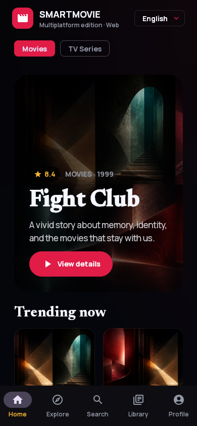
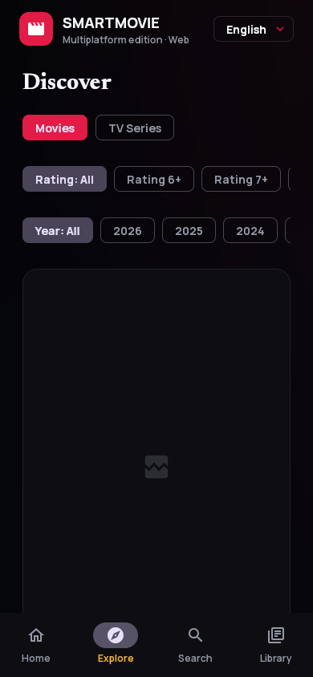
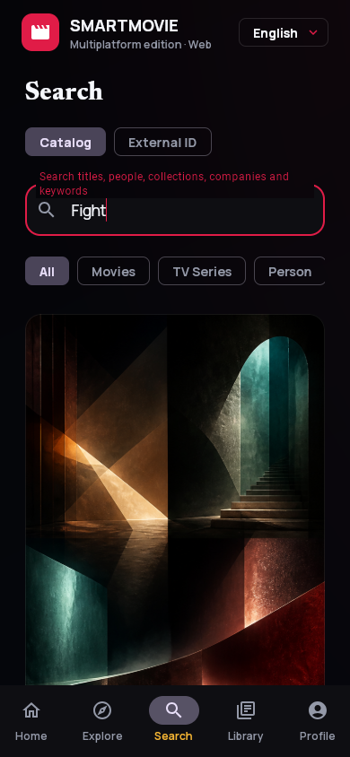
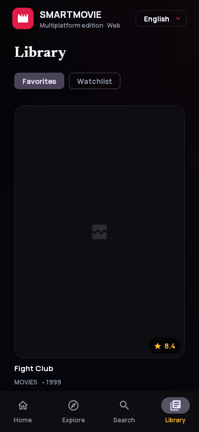

# SmartMovie screen gallery

This gallery documents the SmartMovie 3.0 interface across the shared Compose Multiplatform flow and native Android form factors. Captures use deterministic local catalog data so they remain stable and never expose an account session, adult title, personal list, or production credential.

## Core flow — Compose Multiplatform

The same shared Kotlin UI and data layer powers macOS, Windows, Linux, and responsive Web/Wasm. Compact browser captures below show the primary user journey from discovery to a saved title.

<table>
  <tr>
    <td width="33%" align="center"><strong>Home</strong> Movie/TV switch, hero, and trending shelf</td>
    <td width="33%" align="center"><strong>Explore</strong> Media, rating, and year filters</td>
    <td width="33%" align="center"><strong>Search</strong> Debounced title search and scope selection</td>
  </tr>
  <tr>
    <td></td>
    <td></td>
    <td></td>
  </tr>
  <tr>
    <td width="33%" align="center"><strong>Detail</strong> Trailer, Favorite, Watchlist, story, and cast</td>
    <td width="33%" align="center"><strong>Library</strong> Local Favorites and Watchlist</td>
    <td width="33%" align="center"><strong>Adaptive desktop</strong> Navigation rail and expanded content grid</td>
  </tr>
  <tr>
    <td></td>
    <td></td>
    <td></td>
  </tr>
</table>

## Native Android form factors

These images are the committed screenshot-test baselines. They verify the cinematic palette, typography, spacing, responsive navigation, TV presentation, and Wear OS remote without relying on a live catalog service.

### Android phone

Compact phones use bottom navigation for Home, Explore, Search, and Library.

  

### Tablet, foldable, and ChromeOS

Expanded windows move navigation to a rail and increase shelf density. The same adaptive composition covers tablets, unfolded devices, desktop-sized ChromeOS windows, and Android XR Home Space panels.

  

### Android TV

The 10-foot layout has dedicated TV navigation, high-visibility focus treatment, D-pad traversal, and retained focus when returning from details.

  

### Wear OS remote

The watch companion mirrors the safe title or exact episode open on the paired phone. A title exposes detail, trailer, Favorite, and Watchlist actions; an episode exposes only an exact series/season/episode handoff.

  

## Capture notes

- Compose Multiplatform captures were generated at `390 × 844` and `1280 × 720` from deterministic contract-compatible preview data.
- Native images are Roborazzi golden baselines used by Android CI for compact phone, expanded tablet, 1080p TV, and round Wear OS coverage.
- Artwork placeholders are intentional in deterministic previews; production builds load configured poster and backdrop URLs from the SmartMovie Worker.
- Android Auto is intentionally excluded because SmartMovie is a video catalog and does not declare an Android for Cars app category.
