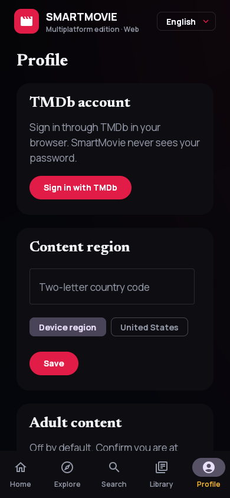

# Smart Movie Android screen gallery

This development gallery combines Web/Wasm preview captures and native Android component goldens. It is not a set of store-release or live-TMDb screenshots. Captures never contain a personal TMDb session, adult title, private list, PIN or production credential. Abstract artwork is generated demo imagery from 2026-08-28, not the poster or portrait for the displayed title/person.

## Compose Multiplatform core flow

The same Kotlin UI/data layer powers native desktop packages for macOS, Windows and Linux plus JavaScript and Wasm browser distributions. Compact captures document every primary destination and a typed `/v2` title detail.

<table>
  <tr>
    <td width="33%" align="center"><strong>Home</strong> Movie/TV switch, hero and trending</td>
    <td width="33%" align="center"><strong>Explore</strong> Advanced catalog filters</td>
    <td width="33%" align="center"><strong>Search</strong> Catalog/external ID and entity scopes</td>
  </tr>
  <tr>
    <td align="center"></td>
    <td align="center"></td>
    <td align="center"></td>
  </tr>
  <tr>
    <td width="33%" align="center"><strong>Detail</strong> Typed metadata, trailer and library actions</td>
    <td width="33%" align="center"><strong>Library</strong> Favorite and Watchlist local state</td>
    <td width="33%" align="center"><strong>Profile</strong> TMDb auth, region and adult-content PIN</td>
  </tr>
  <tr>
    <td align="center"></td>
    <td align="center"></td>
    <td align="center"></td>
  </tr>
</table>

### Expanded desktop and web

At larger widths, navigation moves to a rail and content density increases. This same responsive composition is shipped by desktop JVM, JS and Wasm targets.

  

## Native Android form factors

These committed Roborazzi baselines exercise the cinematic palette, typography, spacing and responsive compositions without a live catalog dependency. They are component captures, not full app/device captures; their null image paths intentionally exercise placeholders and cannot establish whether native network images load.

### Android phone

The compact golden covers the native Home hero and horizontal catalog shelves used by Android phones.

  

### Tablet, foldable, ChromeOS and Android XR Home Space

Expanded windows increase shelf density and use adaptive navigation. The same 2D composition covers tablets, unfolded devices, resizable ChromeOS windows and XR Home Space panels.

  

### Android TV

The dedicated 10-foot composition provides high-visibility focus treatment, D-pad traversal and retained focus when returning from details.

  

### Wear OS companion

Wear OS mirrors only the safe title or exact episode open on the paired phone. A title can hand off to detail/trailer/library actions; an episode hands off to the exact series, season and episode and never exposes adult content.

  

## Capture provenance

| Surface | Capture | Source |
| --- | --- | --- |
| Android phone | Native Home | Roborazzi compact golden |
| Tablet/foldable/ChromeOS/XR | Native expanded Home | Roborazzi expanded golden |
| Android TV | Native 1080p Home | Roborazzi TV golden |
| Wear OS | Round remote | Roborazzi Wear golden |
| Desktop-sized web viewport | Expanded Home | KMP Web/Wasm build, not a native desktop package capture |
| Responsive Web/Wasm | Home, Explore, Search, Detail, Library, Profile | Local preview at `390 × 844`, captured 2026-08-28 |

Native desktop packages (macOS/Windows/Linux), JS fallback, physical Android/TV/Wear devices and XR need separate release-candidate captures. A shared composition does not replace platform-specific evidence.

Production clients obtain image configuration/paths from the Worker and load image bytes from the configured CDN. The local preview serves generated illustrations from `multiplatform/tools/preview_artwork`; it does not replace missing production images. See the shared [image diagnostics](https://github.com/LamPPKK/Smart-Movie-iOS/blob/main/docs/IMAGE_LOADING.md) for the unresolved Worker DNS blocker. Android Auto is intentionally excluded because Smart Movie is a video catalog and does not declare an Android for Cars category.
